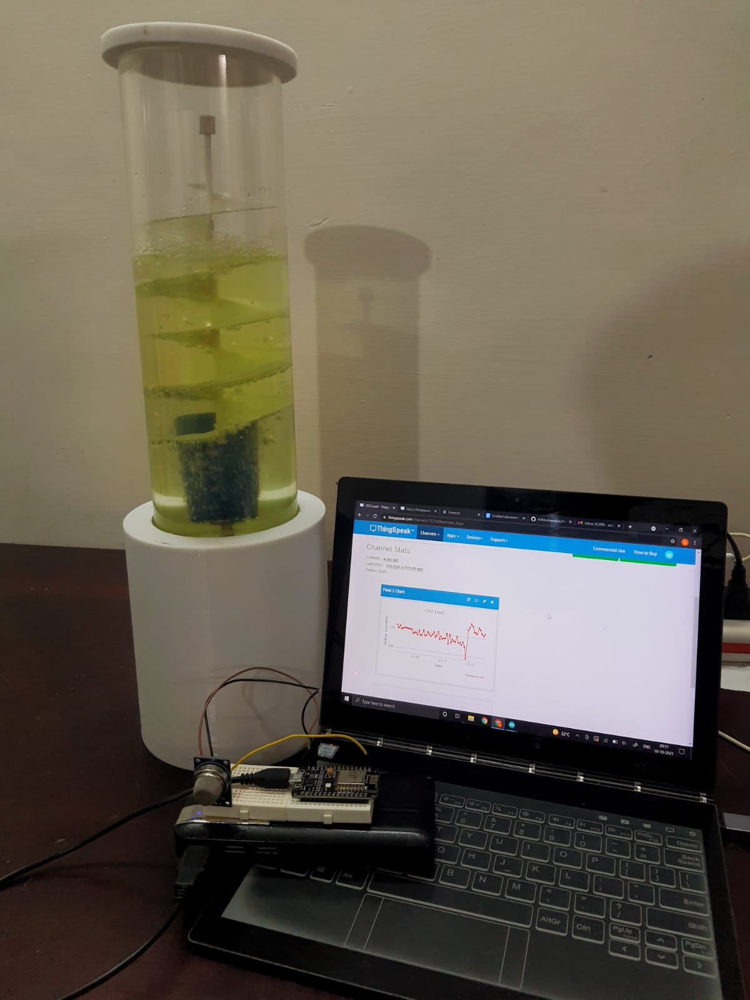

<h1 align="center">Aria</h1>

<h3 align="center">Aria: Carbon Capture Unit</h3>

## Inspiration
While I was thinking about the sustainability track, I realized that one of the biggest challenges faced by humanity is carbon emissions, global warming and climate change. According to Dr.Fatih Birol, IEA Executive Director - "Global carbon emissions are set to jump by 1.5 billion tonnes this year. This is a dire warning that the economic recovery from the Covid crisis is currently anything but sustainable for our climate." With this concern in mind, I decided to work on a model which could possibly be a small compact carbon-capturing system to reduce the carbon footprint around the world.

## What it does
The system is designed to capture CO2 directly from the atmosphere using microalgae as our biofilter.

## How I built it
Our plan was to first develop a design that could house the microalgae. I designed a chamber in Fusion 360 which I later 3D printed to house the microalgae. The air from the surroundings is directed into the algal chamber using an aquarium aerator. The pumped in air moves into the algal chamber through an air stone bubble diffuser which allows the air to break into smaller bubbles. These smaller air bubbles make the CO2 sequestration easier by giving the microalgae more time to act upon it. I have made a spiral design inside the chamber so that the bubbles travel upward through the chamber in a spiral fashion, giving the microalgae even more time to act upon it. This continuous process in due course would lead to capturing of CO2 and production of oxygen.

## Challenges I ran into
3D printing the parts of the chamber within the specified time. Getting our hands on enough microalgae to fill up the entire system in its optimal growth period (log phase) for the best results. Making the chamber leakproof.

## Accomplishments that I am proud of
The hardware design that I was able to design and build over the stipulated time. Develop the system which could actually bring down CO2 levels by utilizing the unique side of microalgae.

## What I learned
I came across a lot of research papers implicating the best use of microalgae in its role to capture CO2. Time management: Learnt to design and develop a system from scratch in a short period.

## What's next for Aria
I plan to conduct more research using microalgae and enhance the design of the existing system I built so that I could increase the carbon capture efficiency of the system. Keeping in mind the deteriorating indoor air quality, I also plan to integrate it with the inorganic air filters so that it could help in improving the overall indoor air quality. I also plan to conduct research on finding out how much area does one unit of Aria covers
